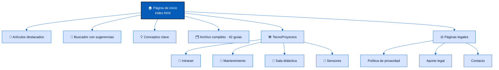

<div align="center">


# Construyendo Conocimiento Tecnológico

**Blog de tecnología, hardware y seguridad digital**

*Proyecto productivo del SENA* 🎓

[](https://blog-informativo.construyendoconocimiento.workers.dev)


</div>

---

> 🏫 **Aviso:** este blog es un proyecto educativo independiente. No es el sitio oficial de ninguna institución.

## ✨ ¿Qué es este proyecto?

**"Construyendo Conocimiento Tecnológico"** es un blog informativo en español creado como **proyecto productivo del SENA**. La idea central es simple: la tecnología a veces intimida, y este blog la explica en **lenguaje sencillo, paso a paso y con imágenes**, para que cualquier persona pueda aprender sin ser experta.

**¿A quién va dirigido?** A compañeros del colegio, estudiantes y público general que quiera entender la tecnología sin tecnicismos.

### 📚 ¿Qué temas enseña?

- 🖥️ **Mantenimiento de computadores** — limpieza física de equipos y ventiladores, prevención del sobrecalentamiento, copias de seguridad y cuidado del hardware.
- 🔐 **Seguridad digital** — protección contra estafas en línea y phishing, derechos digitales y las leyes colombianas que amparan tu información (Ley 1273, Decreto 351 y más).
- 🤖 **Inteligencia artificial como apoyo al estudio** — cómo usarla como tutor personal de forma responsable.
- ♿ **Accesibilidad e inclusión** — herramientas como el dictado por voz y los lectores de pantalla.
- 🧠 **Conceptos básicos** — los fundamentos que sirven de base para todo lo demás.

### 🎯 ¿Por qué existe?

Es el proyecto productivo de la técnica: demuestra que el grupo sabe **investigar un tema, redactarlo para un público no técnico y construir un sitio web real**, publicado y funcionando en internet. Además de las **42 guías** publicadas, el sitio incluye:

- 🛠️ **TecnoProyectos:** 4 proyectos de otros grupos del SENA (intranet, mantenimiento, sala didáctica y sensores), con videos de presentación y manuales en PDF.
- 🔎 **Buscador** con sugerencias, 🌗 tema **claro/oscuro** y 📱 diseño adaptable al celular.
- ⚖️ Páginas legales: política de privacidad, aporte legal y contacto.
- 🧩 Todo hecho a mano con **HTML, CSS y JavaScript puro**: sin frameworks, sin instalaciones y sin proceso de compilación.

🔗 **Visítalo aquí:** https://blog-informativo.construyendoconocimiento.workers.dev

## 🧭 Mapa del sitio



## 📁 Estructura del repositorio

```text
blog-informativo/
├── index.html                     Página de inicio: portada, buscador y secciones
├── articulos/                     42 guías, una carpeta por artículo
│   ├── <Título del artículo>/
│   │   ├── <Título del artículo>.html   La página (mismo nombre que su carpeta)
│   │   └── src/                         Las imágenes del artículo
│   └── script/                    JS de la lista de artículos y de cada guía
├── legal/                         Privacidad · Aporte legal · Contacto
├── proyectos de los otros grupos/ TecnoProyectos: intranet, mantenimiento,
│                                  sala didáctica y sensores
├── styles/
│   └── style_global.css           Todos los estilos y colores del sitio
├── fonts/                         Fuentes propias del sitio (.woff2)
├── assets/logo/                   Logo del blog
├── script/
│   ├── script_index.js            Tema, buscador y animaciones del inicio
│   └── verificar_articulos.py     Revisión automática de los artículos
├── wrangler.jsonc                 Configuración del despliegue en Cloudflare
├── .assetsignore                  Archivos que NO se publican en internet
├── sitemap.xml                    Mapa del sitio para los buscadores
└── robots.txt                     Permisos para los buscadores
```

---

<div align="center">

**Construyendo Conocimiento Tecnológico** · Proyecto productivo SENA 💙

</div>
